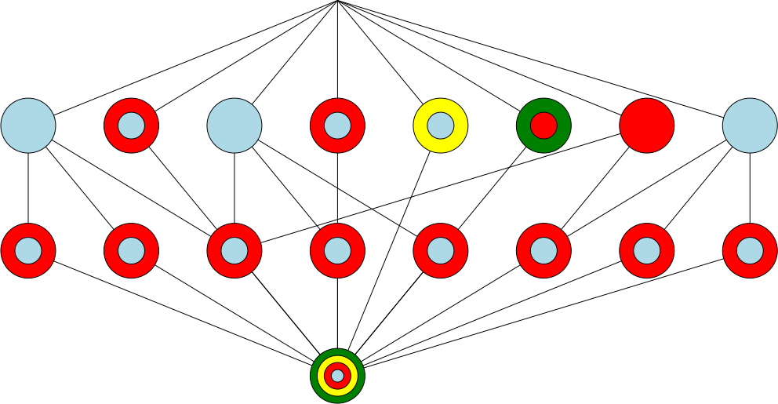

.. raw:: html

    <object data="_traceability_file.svg" type="image/svg+xml"></object>
    
<a href="https://en.wikipedia.org/wiki/Formal_concept_analysis">FCA</a>
                  diagram of dependencies with clickable nodes: ra lightblue, sr red, dd yellow, tp green

.. _`tr0`:

:tr0:

|dhy|, |r1p|, |r62|, |r8d|, |r90|, |r9g|, |r9h|, |rak|, |rbc|, |rj4|, |roc|, |rpn|, |rstdcx|, |rvd|, |rvl|, |rwj|, |s0t|, |s10|, |s1g|, |s45|, |s8c|, |scs|, |seo|, |sgt|, |sim|, |son|, |sxr|, |test_lnkname|

Up: |tr2|, |tr4|, |tr5|, |tr7|, |tr8|, |tr10|, |tr12|, |tr13|, |tr14|, |tr15|, |tr16|, |tr17|

Down: 

.. _`tr1`:

:tr1:

Up: 

Down: |tr3|, |tr6|, |tr9|, |tr11|, |tr14|, |tr15|, |tr16|, |tr17|

.. _`tr2`:

:tr2:

|r62|, |r9g|, |r9h|, |rbc|, |rj4|, |rpn|, |rstdcx|, |rvd|, |rwj|, |s45|, |sgt|

Up: |tr3|, |tr6|, |tr9|

Down: |tr0|

.. _`tr3`:

:tr3:

|rbc|

Up: |tr1|

Down: |tr2|, |tr4|, |tr5|

.. _`tr4`:

:tr4:

|rbc|, |s0t|

Up: |tr3|

Down: |tr0|

.. _`tr5`:

:tr5:

|rbc|, |s10|

Up: |tr3|

Down: |tr0|

.. _`tr6`:

:tr6:

|rvd|

Up: |tr1|

Down: |tr2|, |tr7|, |tr8|

.. _`tr7`:

:tr7:

|rvd|, |scs|

Up: |tr6|

Down: |tr0|

.. _`tr8`:

:tr8:

|rvd|, |sim|

Up: |tr6|

Down: |tr0|

.. _`tr9`:

:tr9:

|sgt|

Up: |tr1|

Down: |tr2|, |tr10|

.. _`tr10`:

:tr10:

|r1p|, |roc|, |sgt|

Up: |tr9|, |tr11|

Down: |tr0|

.. _`tr11`:

:tr11:

|roc|

Up: |tr1|

Down: |tr10|, |tr12|, |tr13|

.. _`tr12`:

:tr12:

|r8d|, |roc|, |s8c|

Up: |tr11|

Down: |tr0|

.. _`tr13`:

:tr13:

|roc|, |s1g|

Up: |tr11|

Down: |tr0|

.. _`tr14`:

:tr14:

|dhy|, |rak|

Up: |tr1|

Down: |tr0|

.. _`tr15`:

:tr15:

|rvl|, |sxr|

Up: |tr1|

Down: |tr0|

.. _`tr16`:

:tr16:

|son|, |test_lnkname|

Up: |tr1|

Down: |tr0|

.. _`tr17`:

:tr17:

|r90|, |seo|

Up: |tr1|

Down: |tr0|

.. _`fig_traceability_file`:

   |fig_traceability_file|: `FCA <https://en.wikipedia.org/wiki/Formal_concept_analysis>`__ diagram of dependencies: ra lightblue, sr red, dd yellow, tp green

